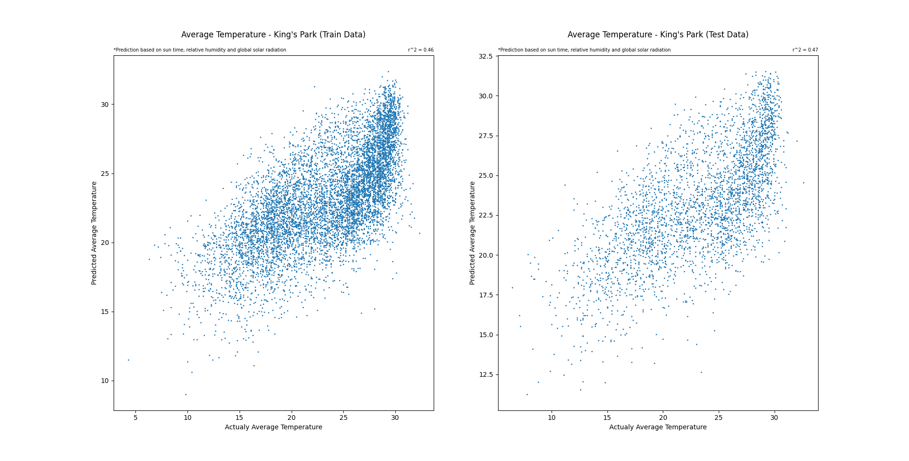
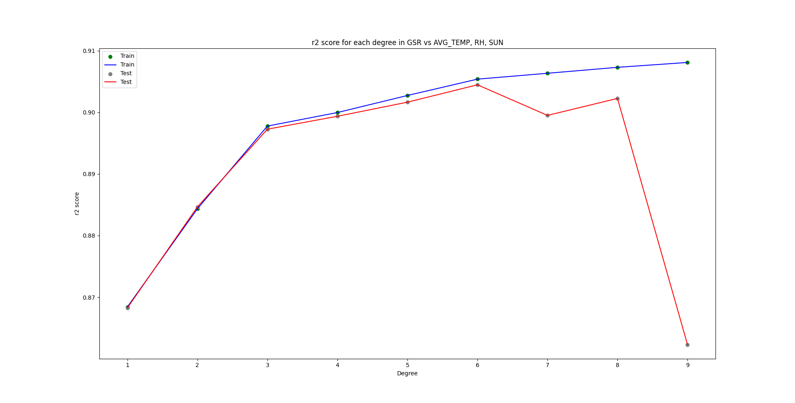
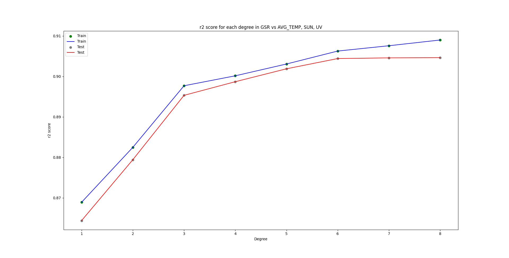

## Global-Solar-Radiation-in-King-s-Park

Utilizing Machine Learning Regression Model to predict tge global solar radiation using the data that collected in King's Park

## First Approach - Trying to predict the average temperature

- Using MySQL and query to handle data
- Using variables including bright sun time, relative humidity and global solar radiation
- Analysing Linear Regression and various degrees of Polynomial Regression's accuracy
- Result: Data Correlation are bad, also may be due to city's heat island effect, it's not that easy to predict with such a little dataset that could be found on the gov db, r2 = 0.47

<p align="center">  
  
</p>

## Second Approach - Turn the predicting variable to the GSR

- Turned to use pandas to handle data
- Added 3 more variables including rainfall, uv and mean wind speed
- Preprocessed the data with feature selection and normalization

## Result

### Polynomial Regression's Degree Optimization

- After the data preprocessing, using degree=6 to optimize the model

<p align="center">  
  
  
  
</p>

### Prediction Result on GSD with AVG_TEMP, SUN and UV

- r2 = 0.9044

<p align="center">  
  
</p>

<a name='run_locally'></a>

### Correlation

| EMPTY    | AVG_TEMP  | GSR       | RH        | SUN       | RF        | UV        | WSPD      |
| -------- | --------- | --------- | --------- | --------- | --------- | --------- | --------- |
| AVG_TEMP | 1.000000  | 0.439289  | 0.294813  | 0.261222  | 0.143698  | 0.360520  | -0.069801 |
| GSR      | 0.439289  | 1.000000  | -0.143867 | 0.905922  | -0.305681 | 0.122465  | -0.100102 |
| RH       | 0.294813  | -0.143867 | 1.000000  | -0.274133 | 0.219243  | 0.236309  | 0.013089  |
| SUN      | 0.261222  | 0.905922  | -0.274133 | 1.000000  | -0.291873 | -0.006021 | -0.143479 |
| RF       | 0.143698  | -0.305681 | 0.219243  | -0.291873 | 1.000000  | 0.130049  | 0.064917  |
| UV       | 0.360520  | 0.122465  | 0.236309  | -0.006021 | 0.130049  | 1.000000  | -0.033784 |
| WSPD     | -0.069801 | -0.100102 | 0.013089  | -0.143479 | 0.064917  | -0.033784 | 1.000000  |

## Run Locally

1. Clone the project to your repository

```sh
git clone https://github.com/Argonaut790/Global-Solar-Radiation-in-King-s-Park.git
```

2. Change to the project directory

```sh
cd .\Global-Solar-Radiation-in-King-s-Park
```

3. Install the package and dependencies

```sh
pip install -r requirements.txt
```

<a name='license'></a>

## License

[MIT license](./LICENSE)
