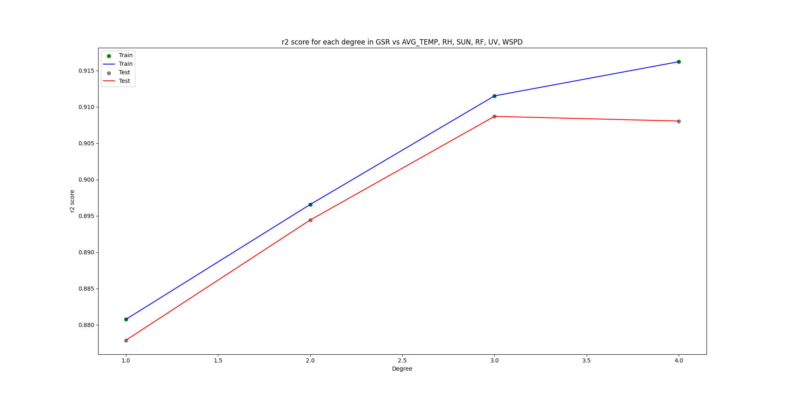

## Global-Solar-Radiation-in-King-s-Park
Utilizing Machine Learning Regression Model to predict tge global solar radiation using the data that collected in King's Park

## First Approach - Trying to predict the average temperature
- Using MySQL and query to handle data
- Using variables including bright sun time, relative humidity and global solar radiation
- Analysing Linear Regression and various degrees of Polynomial Regression's accuracy
- Result: Data Correlation are bad, also may be due to city's heat island effect, it's not that easy to predict with such a little dataset that could be found on the gov db, r2 = 0.47

## Second Approach - Turn the predicting variable to the GSR
- Turned to use pandas to handle data
- Added 3 more variables including rainfall, uv and mean wind speed
- Preprocessed the data with feature selection and normalization

## Result
### Polynomial Regression's Degree Optimization
- After the data preprocessing, using degree=6 to optimize the model
<p align="center">  
  
  
  
</p> 

### Prediction Result on GSD with AVG_TEMP, SUN and UV
- r2 = 0.9044
<p align="center">  
  
</p> 

<a name='run_locally'></a>
## Run Locally
1. Clone the project to your repository

```sh
git clone https://github.com/Argonaut790/Global-Solar-Radiation-in-King-s-Park.git
```
2. Change to the project directory

```sh
cd .\Global-Solar-Radiation-in-King-s-Park
```
3. Install the package and dependencies

```sh
pip install -r requirements.txt
```

<a name='license'></a>
## License
[MIT license](./LICENSE)
